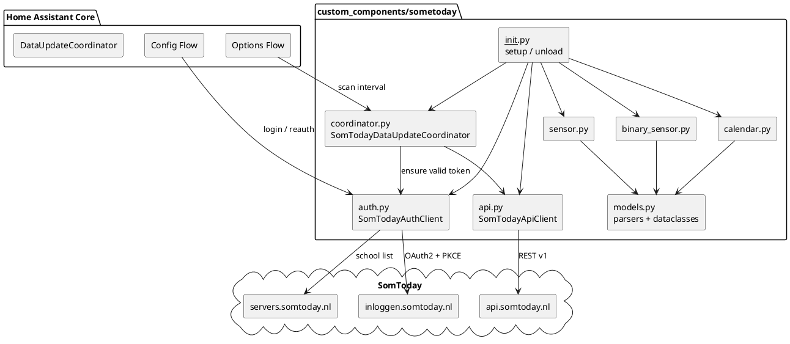
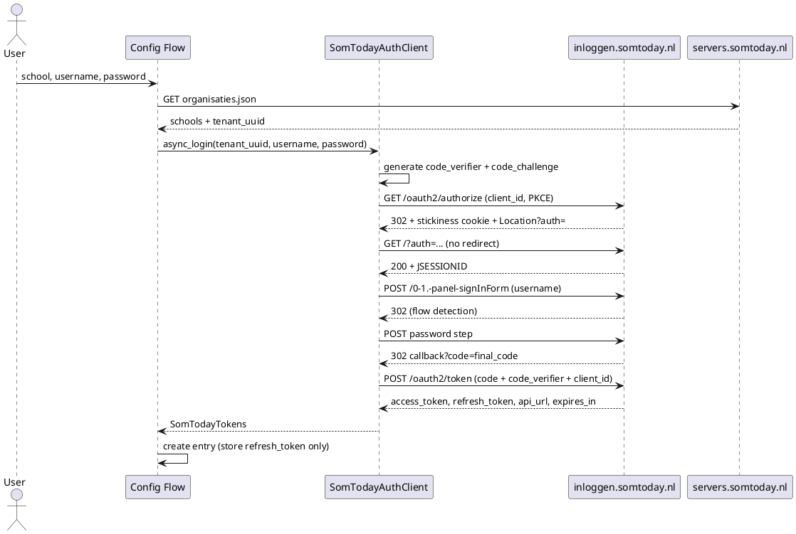
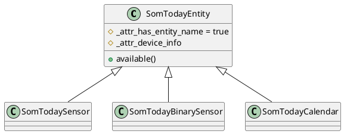

# Architecture: SomToday Home Assistant Integration

> Technical design for the SomToday custom component.
> Author: architect-agent (per `AGENTS.md`). Status: **Proposed v1**.
> Source of truth for the API: <https://github.com/elisaado/somtoday-api-docs>.

## 0. Scope

This document describes the integration structure, the SomToday API endpoints,
the OAuth2 login flow, the entity model and the error handling. It supersedes
the earlier draft: that draft referenced endpoints that do not exist
(`/rest/v1/leerlingen/{id}/rooster`, `/huiswerk`, `/cijfers`) and omitted the
mandatory `client_id` and PKCE. See [§14](#14-corrections-to-the-previous-draft).

## 1. Focus finding: does the authorization API require a client ID?

**Yes. A `client_id` is mandatory in every authorize, token and refresh
request. No `client_secret` is required.**

Evidence:

1. **Documentation** (`Authentication.md`) lists `client_id` as a required
   parameter in all flows:

   | Request | `client_id` |
   |---------|-------------|
   | `GET https://inloggen.somtoday.nl/oauth2/authorize` (app/webapp, PKCE) | `somtoday-leerling-native` |
   | `POST https://inloggen.somtoday.nl/oauth2/token` (code exchange, PKCE) | `somtoday-leerling-native` |
   | `GET https://somtoday.nl/oauth2/authorize` (SSO) | `D50E0C06-32D1-4B41-A137-A9A850C892C2` |
   | `POST https://somtoday.nl/oauth2/token` (SSO code exchange) | `D50E0C06-32D1-4B41-A137-A9A850C892C2` |
   | `POST https://somtoday.nl/oauth2/token` (legacy `grant_type=password`) | `D50E0C06-32D1-4B41-A137-A9A850C892C2` |
   | `POST https://inloggen.somtoday.nl/oauth2/token` (refresh, PKCE) | `somtoday-leerling-native` |
   | `POST https://somtoday.nl/oauth2/token` (refresh, password grant) | `D50E0C06-32D1-4B41-A137-A9A850C892C2` |

2. **Live check** (2026-09-11): `GET https://inloggen.somtoday.nl/oauth2/authorize`
   with a valid `response_type`, `scope`, `redirect_uri`, `state`,
   `code_challenge` and `code_challenge_method`, but **without** `client_id`,
   returns **HTTP 400**. Adding `client_id=somtoday-leerling-native` makes the
   endpoint proceed to the identity-provider login (the fetch tool could not
   follow the `somtoday://` custom-scheme redirect, but the 400 disappears).

Nuances that shape the design:

- **No client secret.** Since April 2021 SomToday uses *public* OAuth2 clients;
  PKCE (`code_challenge_method=S256`) replaces the secret. The docs explicitly
  state the former `client_secret` is no longer needed.
- **The client ID is a public constant, not user input.** The config flow must
  **not** ask the user for a client ID. It ships as `const.py` constant.
- Two public client IDs are known; v1 uses `somtoday-leerling-native` because it
  is the one paired with the current app/webapp PKCE flow.
- Some schools authenticate via an external IdP (`oidcurls` in
  `organisaties.json`). Those **SSO-only** accounts cannot be completed
  server-side and are out of scope for v1 (see [§12](#12-limitations--open-questions)).

## 2. Overview and design goals

The integration reads SomToday data (schedule, homework, grades, absence) and
exposes it as Home Assistant entities. It follows the standard HA integration
framework:

- `ConfigFlow` + `OptionsFlow` for configuration (`config_flow.py`).
- `DataUpdateCoordinator` polling every **15 minutes** by default (`coordinator.py`).
- An OO API client with an **injectable `aiohttp.ClientSession`** (`api.py`).
- Platforms: `sensor`, `binary_sensor`, `calendar`.
- All parsing isolated in a typed model layer (`models.py`) so entities never
  touch raw JSON.

Design principles:

1. Standard HA patterns over custom plumbing (`entry.runtime_data`,
   `CoordinatorEntity`, `has_entity_name`, translation keys).
2. No third-party runtime dependency: use HA's shared `aiohttp` session. This
   keeps `manifest.json` `requirements` empty and simplifies testing.
3. Pure separation: **auth** (`SomTodayAuthClient`) / **transport**
   (`SomTodayApiClient`) / **parsing** (`models.py`) / **orchestration**
   (`coordinator.py`) / **presentation** (platforms).
4. Secrets are minimised: the password is used once during the config flow and
   never stored; only the refresh token is persisted.

### Component diagram



### Class model

```text
SomTodayAuthClient
  - session: aiohttp.ClientSession
  - tenant_uuid: str
  - client_id: str = "somtoday-leerling-native"
  - tokens: SomTodayTokens | None
  + async_login(username, password) -> SomTodayTokens
  + async_refresh() -> SomTodayTokens
  + async_ensure_valid() -> None
  - _async_pkce_login(username, password) -> SomTodayTokens
  - _async_password_grant(username, password) -> SomTodayTokens   # fallback
  - _generate_pkce_pair() -> tuple[str, str]
  - _extract_code(location: str) -> str

SomTodayApiClient
  - session: aiohttp.ClientSession
  - auth: SomTodayAuthClient
  - base_url: str
  + async_get_students() -> list[Student]
  + async_get_schedule(start, end) -> list[Lesson]
  + async_get_grades(student_id) -> list[Grade]
  + async_get_homework(since) -> list[HomeworkItem]
  + async_get_absence(start, end) -> list[Absence]
  + async_get_subjects() -> list[Subject]
  - _request(method, path, **kwargs) -> dict          # injects auth + Accept
  - _request_paginated(path, page_size=100) -> list   # Range: items=0-99

SomTodayDataUpdateCoordinator(DataUpdateCoordinator[SomTodayData])
  + _async_update_data() -> SomTodayData

SomTodayData (dataclass)
  + students: list[Student]
  + schedule: list[Lesson]
  + grades: list[Grade]
  + homework: list[HomeworkItem]
  + absence: list[Absence]
  + subjects: dict[str, Subject]
  + new_grades: list[Grade]
  + updated_at: datetime
```

## 3. Authentication / OAuth2 flow

### 3.1 Chosen strategy

**Primary: PKCE authorization-code flow mimicking the SomToday app/webapp.**
This is the documented current method. It runs entirely server-side with
`aiohttp` (no browser), which is required because HA config flows cannot open a
browser to a custom-scheme redirect.

**Fallback: legacy password grant** (`grant_type=password`,
`client_id=D50E...`). It is simpler and server-side, but the docs label it
"Possibly deprecated". It is kept behind the same `SomTodayAuthClient`
interface and only attempted if the PKCE flow fails with an unsupported-school
condition. It must not be the default.

The strategy is selected per school/account; the chosen method is stored in the
config entry (`auth_method`).

### 3.2 PKCE flow (primary)

1. **School discovery** — `GET https://servers.somtoday.nl/organisaties.json`.
   Returns `instellingen[]` with `uuid` (tenant UUID), `naam`, `plaats` and
   optional `oidcurls`.
2. **Generate PKCE pair** — `code_verifier` = 128 chars from
   `[a-z1-9]`; `code_challenge` = base64url(SHA-256(verifier)) with
   `=` stripped.
3. **Authorize** — `GET https://inloggen.somtoday.nl/oauth2/authorize` with
   `redirect_uri=somtoday://nl.topicus.somtoday.leerling/oauth/callback`,
   `client_id=somtoday-leerling-native`, `response_type=code`, `state=<8 chars>`,
   `scope=openid`, `tenant_uuid=<uuid>`, `session=no_session`,
   `code_challenge`, `code_challenge_method=S256`.
   Do **not** follow redirects. Capture the `production-authenticator-stickiness`
   cookie and the `Location` header (`...?auth=<authorization_code>`).
4. **Establish session** — `GET https://inloggen.somtoday.nl/` with the `auth`
   query parameter and the stickiness cookie; do not follow redirects. Capture
   `JSESSIONID`.
5. **Username step** — `POST https://inloggen.somtoday.nl/0-1.-panel-signInForm`
   with `usernameFieldPanel:usernameFieldPanel_body:usernameField=<username>`,
   `auth`, `Origin` and cookies. Inspect the `Location` header:
   - `auth` present → **username + password** flow (both fields in one POST).
   - otherwise → **username-first** flow (username already submitted).
6. **Password step** —
   - username-first: `POST https://inloggen.somtoday.nl/login?2-1.-passwordForm`
     with `passwordFieldPanel:passwordFieldPanel_body:passwordField=<password>`.
   - username + password: `POST https://inloggen.somtoday.nl/?0-1.-panel-signInForm`
     with both the username and password fields.
   Do not follow redirects; parse `code` (the final authorization code) from the
   `Location` header.
7. **Exchange** — `POST https://inloggen.somtoday.nl/oauth2/token` with
   `grant_type=authorization_code`, `code`, `code_verifier`,
   `client_id=somtoday-leerling-native`, `tenant_uuid`, `session=no_session`,
   `scope=openid`.
8. **Store** the response:
   `access_token`, `refresh_token`, `somtoday_api_url`,
   `somtoday_tenant`, `expires_in` (typically 3600 s).
   Only `refresh_token`, `api_url`, `tenant_uuid` and account metadata are
   persisted; the password is discarded.



### 3.3 Token refresh

- `SomTodayTokens.expires_at = utcnow() + expires_in`.
- `async_ensure_valid()` refreshes proactively when
  `expires_at - now < 120 s`, and `SomTodayApiClient` refreshes **reactively**
  once on a `401`.
- Refresh call: `POST https://inloggen.somtoday.nl/oauth2/token` with
  `grant_type=refresh_token`, `refresh_token`, `client_id=somtoday-leerling-native`
  (or the client ID of the method used), `scope=openid`.
- **Rotating refresh tokens:** the response contains a new `refresh_token`. The
  coordinator writes it back atomically:

  ```python
  self.hass.config_entries.async_update_entry(
      entry, data={**entry.data, CONF_REFRESH_TOKEN: new_refresh_token}
  )
  ```

  Without this, the integration breaks after the first refresh. Refresh is
  serialised with an `asyncio.Lock` to avoid concurrent rotations.

### 3.4 Config entry data / options

**`entry.data`** (secrets minimised):

```json
{
  "tenant_uuid": "099ce144-c400-4468-95d4-ad36f9f5cb5c",
  "school_name": "Etty Hillesum Lyceum",
  "username": "450000@live.bc-enschede.nl",
  "auth_method": "pkce",
  "refresh_token": "<secret>",
  "api_url": "https://api.somtoday.nl",
  "student_id": 1234,
  "student_name": "Eli Saado"
}
```

**`entry.options`:**

```json
{
  "scan_interval": 15,
  "schedule_days_ahead": 14,
  "homework_days_ahead": 7,
  "enable_grades": true,
  "enable_homework": true,
  "enable_absence": true
}
```

> **Security note.** HA stores config entries in `.storage/core.config_entries`
> as plaintext JSON; the refresh token is therefore not encrypted. This is the
> standard HA limitation. The password is never stored. Document this to the
> user and recommend restricting `.storage/` permissions.

## 4. Config flow

`config_flow.py` implements `ConfigFlow, OptionsFlow`.

### 4.1 Steps

| Step | Purpose | Input | Errors |
|------|---------|-------|--------|
| `async_step_user` | Select school | `SelectSelector` populated from `organisaties.json` (searchable) | `cannot_connect` |
| `async_step_credentials` | Log in | `username` (`TextSelector`), `password` (`TextSelectorType.PASSWORD`) | `invalid_auth`, `cannot_connect`, `sso_not_supported` |
| `async_step_student` | Pick student if `/rest/v1/leerlingen` returns > 1 | `SelectSelector` | `no_students` |
| `async_step_reauth` → `async_step_reauth_confirm` | Re-login after `ConfigEntryAuthFailed` | `password` (username prefilled) | `invalid_auth`, `cannot_connect` |
| `async_step_init` (options) | Change poll interval / feature toggles | number + booleans | — |

Details:

- **Duplicate detection:** `async_set_unique_id(f"{tenant_uuid}:{username}")`
  and `_abort_if_unique_id_configured()` → abort `already_configured`.
- **Validation:** after a successful login the flow calls
  `GET /rest/v1/leerlingen` once. Success creates the entry; failure maps to
  `invalid_auth`/`cannot_connect`.
- **Reauth:** `entry.data[CONF_USERNAME]` is used to re-run the login; on
  success the refresh token (and API URL) are updated in place.
- **Options:** validated with
  `vol.All(vol.Coerce(int), vol.Range(min=MIN_SCAN_INTERVAL, max=MAX_SCAN_INTERVAL))`
  and applied via `async_create_task(coordinator.async_refresh())` /
  `entry.options` update without a restart.

### 4.2 UI strings

All labels/errors are defined as translation keys in `strings.json` (English)
and `translations/nl.json` (Dutch). No hard-coded user-facing strings.

## 5. DataUpdateCoordinator

```text
SomTodayDataUpdateCoordinator(DataUpdateCoordinator[SomTodayData])
  update_interval = timedelta(minutes=scan_interval)   # default 15
  _async_update_data():
      async with self._lock:
          await self._auth.async_ensure_valid()
          if self._student_id is None:
              students = await self._api.async_get_students()
              self._student_id = students[0].id
          data = SomTodayData(
              students = students,
              schedule = await self._api.async_get_schedule(today-1, today+N),
              grades   = await self._api.async_get_grades(self._student_id) if enabled,
              homework = await self._api.async_get_homework(today-1)        if enabled,
              absence  = await self._api.async_get_absence(week_start, today) if enabled,
              subjects = await self._api.async_get_subjects(),
              updated_at = utcnow(),
          )
          return data
```

- **Default interval:** 15 minutes (`DEFAULT_SCAN_INTERVAL`), minimum 5, maximum
  1440, configurable via options.
- **First refresh:** `await coordinator.async_config_entry_first_refresh()` in
  `async_setup_entry`; failure aborts setup with the standard HA behaviour.
- **Optimisation:** schedule and grades change slowly. A simple modulo counter
  can fetch grades every 4th poll; v1 may fetch everything each poll (the
  endpoints are cheap). Keep the interval conservative to avoid rate limiting.
- **Serialisation:** a single `asyncio.Lock` prevents overlapping refresh + token
  rotation.
- **Cross-poll state:** `new_grade` (see [§8.2](#82-binary_sensor-platform))
  cannot be derived from a single response. The coordinator keeps
  `self._last_grade_ids: set` across polls and populates
  `SomTodayData.new_grades` with the grades whose IDs were not seen in the
  previous poll. The entity is then a pure renderer of that list; the first
  refresh yields no new grades.

### 5.1 Error mapping

| Condition | Raised in client | Coordinator reaction |
|-----------|------------------|----------------------|
| `401` / `403` | `SomTodayAuthError` | refresh once; still failing → `ConfigEntryAuthFailed` |
| Invalid credentials during flow | `SomTodayAuthError` | config flow shows `invalid_auth` |
| Network error / timeout | `SomTodayConnectionError` | `UpdateFailed` → retry next cycle |
| `429 Too Many Requests` | `SomTodayRateLimitError` | `UpdateFailed`, honour `Retry-After` if present |
| `5xx` | `SomTodayApiError` | `UpdateFailed` → retry next cycle |
| Malformed JSON / unexpected schema | `SomTodayApiError` | `UpdateFailed` → retry next cycle |
| SSO-only school | `SomTodaySsoNotSupported` | config flow aborts with `sso_not_supported` |

HA's coordinator already applies exponential backoff after repeated
`UpdateFailed`s; no custom backoff is needed.

## 6. API client

`api.py` — `SomTodayApiClient`, constructed with an **injectable session** so
tests can mock it with `aioresponses`/`unittest.mock`:

```python
class SomTodayApiClient:
    def __init__(
        self,
        session: aiohttp.ClientSession,
        auth: SomTodayAuthClient,
        base_url: str,
    ) -> None: ...
```

- Every request sends `Authorization: Bearer <access_token>` and
  `Accept: application/json` (otherwise the API returns XML).
- `_request` maps HTTP status codes to the exception hierarchy in §5.1.
- `_request_paginated` walks `Range: items=<start>-<end>` in blocks of 100 until
  fewer than 100 records are returned (used by the grades endpoint).
- Parsing lives in `models.py`; the client returns typed dataclasses
  (`Student`, `Lesson`, `Grade`, `HomeworkItem`, `Absence`, `Subject`).

`auth.py` — `SomTodayAuthClient` owns `SomTodayTokens` and the PKCE/password
strategies. It depends only on an injectable `aiohttp.ClientSession` and the
tenant UUID, so the OAuth2 flow is unit-testable without network access.

## 7. SomToday API endpoints

Base URL for data requests = `somtoday_api_url` returned by the token endpoint
(usually `https://api.somtoday.nl`).

### 7.1 Authentication

| Method | URL | Purpose |
|--------|-----|---------|
| GET | `https://servers.somtoday.nl/organisaties.json` | School list (`uuid`, `naam`, `plaats`, `oidcurls`) |
| GET | `https://inloggen.somtoday.nl/oauth2/authorize` | Start PKCE flow |
| POST | `https://inloggen.somtoday.nl/0-1.-panel-signInForm` | Username / flow detection |
| POST | `https://inloggen.somtoday.nl/login?2-1.-passwordForm` | Password (username-first) |
| POST | `https://inloggen.somtoday.nl/?0-1.-panel-signInForm` | Username + password |
| POST | `https://inloggen.somtoday.nl/oauth2/token` | Code exchange + refresh |
| POST | `https://somtoday.nl/oauth2/token` | Legacy password / SSO (fallback) |

### 7.2 Data

| Method | Path (relative to `api_url`) | Purpose | Key parameters |
|--------|------------------------------|---------|----------------|
| GET | `/rest/v1/leerlingen` | Current student(s) | `additional=pasfoto` |
| GET | `/rest/v1/leerlingen/{id}` | Student detail | — |
| GET | `/rest/v1/afspraken` | Schedule | `sort=asc-id`, `additional=vak`, `additional=docentAfkortingen`, `additional=leerlingen`, `begindatum=YYYY-MM-DD`, `einddatum=YYYY-MM-DD` |
| GET | `/rest/v1/resultaten/huidigVoorLeerling/{id}` | Grades (paginated) | `Range: items=0-99` |
| GET | `/rest/v1/studiewijzeritemafspraaktoekenningen` | Homework linked to appointments | `begintNaOfOp=YYYY-MM-DD`, `geenDifferentiatieOfGedifferentieerdVoorLeerling`, `additional`, `jaarWeek` |
| GET | `/rest/v1/studiewijzeritemdagtoekenningen` | Homework per day | `begintNaOfOp`, `geenDifferentiatieOfGedifferentieerdVoorLeerling`, `additional` |
| GET | `/rest/v1/studiewijzeritemweektoekenningen` | Homework per week | `begintNaOfOp`, `geenDifferentiatieOfGedifferentieerdVoorLeerling`, `additional`, `weeknummer` |
| GET | `/rest/v1/absentiemeldingen` | Absence reports | `begindatumtijd`, `einddatumtijd` |
| GET | `/rest/v1/waarnemingen` | Attendance observations | `begintNaOfOp` / `beginDatumTijd` / `eindDatumTijd`, `isGeoorloofd` |
| GET | `/rest/v1/vakken` | Subjects | — |
| GET | `/rest/v1/account/me` | Account info | `additional=restricties` |
| GET | `/rest/v1/icalendar` | iCal feed (alternative calendar source) | — |
| PUT | `/rest/v1/swigemaakt/{id}` | Mark homework done (v2, optional) | body `{leerling, gemaakt}` |
| PUT | `/rest/v1/swigemaakt/cou` | Mark homework done by `leerling` + `swiToekenningId` (v2, optional) | body `{leerling, swiToekenningId, gemaakt}` |

All three `studiewijzeritem*toekenningen` read endpoints accept the repeated
query parameter `additional` with values
`swigemaaktVinkjes`, `leerlingen`, `huiswerkgemaakt`,
`leerlingenMetInlevering`, `lesgroep`, `leerlingProjectgroep` and
`studiewijzerId`. v1 requests `additional=swigemaaktVinkjes` (to derive the done
state) and `additional=lesgroep` (to derive the subject). The appointment
endpoint takes `jaarWeek` where the week endpoint takes `weeknummer`.
The two `swigemaakt` write endpoints are alternatives: `/cou` works with only
the `swiToekenningId` when the `swigemaakt` row does not exist yet.

v1 fetches homework from **appointment + day + week** endpoints and merges them
(deduplicated by `links[0].id`) so no homework type is missed.

### 7.3 JSON → dataclass field reference

This mapping is normative for the `models.py` parsers.

| Dataclass | Field | Source JSON |
|-----------|-------|-------------|
| `Student` | `id` | `links[0].id` |
| | `leerlingnummer` | `leerlingnummer` |
| | `roepnaam` | `roepnaam` |
| | `achternaam` | `achternaam` |
| | `email` | `email` |
| | `mobiel_nummer` | `mobielNummer` |
| | `geboortedatum` | `geboortedatum` |
| | `geslacht` | `geslacht` |
| | `pasfoto` | `additionalObjects.pasfoto.datauri` |
| `Lesson` | `id` | `id` |
| | `subject` | `vak.naam` |
| | `subject_abbr` | `vak.afkorting` |
| | `teacher` | `docentAfkortingen` |
| | `room` | `locatie` |
| | `start` | `beginDatumTijd` |
| | `end` | `eindDatumTijd` |
| | `title` | `titel` |
| | `type` | `afspraakType.naam` |
| `Grade` | `id` | `id` |
| | `result` | `resultaat` (float) |
| | `valid_result` | `geldendResultaat` |
| | `date` | `datumInvoer` |
| | `counts` | `not teltNietmee` |
| | `type` | `type` |
| | `subject` | `vak.naam` |
| `HomeworkItem` | `id` | `links[0].id` |
| | `topic` | `studiewijzerItem.onderwerp` |
| | `kind` | `studiewijzerItem.huiswerkType` |
| | `description` | `omschrijving` |
| | `subject` | `lesgroep.vak.*` |
| | `due` | `datumTijd` (day/appointment) or week range |
| | `done` | `additionalObjects.swigemaaktVinkjes.items[].gemaakt` |
| `Absence` | `id` | `id` |
| | `start` / `end` | `start` / `end` |
| | `reason` | `absentieReden.omschrijving` |
| | `allowed` | `absentieReden.geoorloofd` |
| | `handled` | `afgehandeld` |
| `Subject` | `id` | `id` |
| | `abbr` | `afkorting` |
| | `name` | `naam` |

`HomeworkItem.kind` takes the `studiewijzerItem.huiswerkType` values
`HUISWERK`, `TOETS` and `GROTE_TOETS`. It lets the homework-due sensors and the
calendar distinguish homework from tests (see [§8](#8-entity-model)).

## 8. Entity model

One **device per config entry** (per student). All entities set
`_attr_has_entity_name = True`, use translation keys, and share:

```python
DeviceInfo(
    identifiers={(DOMAIN, entry.entry_id)},
    name=f"SomToday {student_name}",
    manufacturer="SomToday",
    model="Student",
    entry_type=DeviceEntryType.SERVICE,
)
```

Unique IDs: `f"{entry.entry_id}_{key}"`. Availability follows
`CoordinatorEntity.available`; when the coordinator fails, entities become
`unavailable`.

### 8.1 `sensor` platform

| Key | Translation key | Device class | State class | State |
|-----|-----------------|--------------|-------------|-------|
| `next_lesson` | `next_lesson` | `TIMESTAMP` | — | Start of the next lesson |
| `next_lesson_name` | `next_lesson_name` | — | — | Subject of the next lesson |
| `next_lesson_room` | `next_lesson_room` | — | — | Room/location of the next lesson |
| `current_lesson` | `current_lesson` | — | — | Subject of the lesson in progress (`None` when free) |
| `lessons_today` | `lessons_today` | — | `MEASUREMENT` | Number of lessons today |
| `homework_open` | `homework_open` | — | `MEASUREMENT` | Open homework items |
| `homework_due_today` | `homework_due_today` | — | `MEASUREMENT` | Homework due today |
| `homework_next` | `homework_next` | `TIMESTAMP` | — | Due moment of the nearest open homework |
| `average_grade` | `average_grade` | — | `MEASUREMENT` | Mean of valid grades |
| `latest_grade` | `latest_grade` | — | `MEASUREMENT` | Most recently entered grade |
| `grades_count` | `grades_count` | — | `MEASUREMENT` | Number of grades in the period |
| `absence_recent` | `absence_recent` | — | `MEASUREMENT` | Unauthorised absence records this week |

Grade sensors expose per-subject grades as **attributes** (`grades: {subject:
grade}`) and the raw list as `grades_raw` (truncated), so users can build
templates without dozens of entities.

### 8.2 `binary_sensor` platform

| Key | Translation key | Device class | `on` when |
|-----|-----------------|--------------|-----------|
| `in_lesson` | `in_lesson` | `RUNNING` | Now is between a lesson's start and end |
| `has_lesson_today` | `has_lesson_today` | — | At least one lesson today |
| `homework_due_tomorrow` | `homework_due_tomorrow` | `PROBLEM` | Open homework due within 24 h |
| `new_grade` | `new_grade` | — | A grade was added since the previous poll |

`new_grade` renders `SomTodayData.new_grades`, which the coordinator computes
from the persisted `_last_grade_ids` set (see [§5](#5-dataupdatecoordinator));
it is `off` when that list is empty.

`homework_due_tomorrow` (and the calendar) must not conflate homework with
tests. `HomeworkItem.kind` distinguishes `HUISWERK` from `TOETS` /
`GROTE_TOETS`; v1 exposes both but tags the kind in the entity attributes so
users can filter. A `test_due_tomorrow` sensor is a future enhancement.

### 8.3 `calendar` platform

`SomTodayCalendar(CalendarEntity)`:

- `event` → current/next lesson (for the entity card).
- `async_get_events(hass, start_date, end_date)` → all lessons in the requested
  range, derived from the coordinator's `schedule` (the coordinator fetches a
  window of `today-1 … today+schedule_days_ahead`, default 14 days). If HA
  requests a range outside the cached window, the coordinator is refreshed or
  the API is queried for that range.
- Event fields: `summary` = `"{subject} ({room})"`, `start`/`end` from
  `beginDatumTijd`/`eindDatumTijd`, `location` = `locatie`,
  `description` = teacher abbreviations (`docentAfkortingen`).
- Read-only (no `CREATE_EVENT`).



## 9. `__init__.py` and runtime data

```text
async_setup_entry(hass, entry):
    auth = SomTodayAuthClient(
        session,
        entry.data[CONF_TENANT_UUID],
        auth_method=entry.data.get(CONF_AUTH_METHOD),
    )
    auth.tokens = SomTodayTokens.from_entry(entry)
    api = SomTodayApiClient(session, auth, entry.data["api_url"])
    coordinator = SomTodayDataUpdateCoordinator(hass, entry, api, auth)
    await coordinator.async_config_entry_first_refresh()
    entry.runtime_data = SomTodayRuntimeData(api=api, auth=auth, coordinator=coordinator)
    await hass.config_entries.async_forward_entry_setups(entry, PLATFORMS)

async_unload_entry(hass, entry):
    return await hass.config_entries.async_unload_platforms(entry, PLATFORMS)
```

`CONF_AUTH_METHOD` restores the refresh host/client ID after a restart (see
[§12.2](#12-limitations--open-questions)). When the rotating refresh token
changes, persist `auth.as_entry_data()` (which includes `CONF_AUTH_METHOD`)
rather than `tokens.as_entry_data()`.

`entry.runtime_data` (modern HA pattern) is preferred over `hass.data[DOMAIN]`.
`async_migrate_entry` is provided for future schema changes.

## 10. Constants (`const.py`)

```python
DOMAIN = "sometoday"
PLATFORMS = [Platform.SENSOR, Platform.BINARY_SENSOR, Platform.CALENDAR]

CONF_TENANT_UUID = "tenant_uuid"
CONF_SCHOOL_NAME = "school_name"
CONF_USERNAME = "username"
CONF_REFRESH_TOKEN = "refresh_token"
CONF_API_URL = "api_url"
CONF_STUDENT_ID = "student_id"
CONF_STUDENT_NAME = "student_name"
CONF_AUTH_METHOD = "auth_method"
CONF_SCAN_INTERVAL = "scan_interval"
CONF_SCHEDULE_DAYS_AHEAD = "schedule_days_ahead"
CONF_HOMEWORK_DAYS_AHEAD = "homework_days_ahead"
CONF_ENABLE_GRADES = "enable_grades"
CONF_ENABLE_HOMEWORK = "enable_homework"
CONF_ENABLE_ABSENCE = "enable_absence"

DEFAULT_SCAN_INTERVAL = 15          # minutes
MIN_SCAN_INTERVAL = 5
MAX_SCAN_INTERVAL = 1440
DEFAULT_SCHEDULE_DAYS_AHEAD = 14
DEFAULT_HOMEWORK_DAYS_AHEAD = 7

# Public OAuth2 clients (no secret; PKCE replaces it)
CLIENT_ID_APP = "somtoday-leerling-native"
CLIENT_ID_SSO = "D50E0C06-32D1-4B41-A137-A9A850C892C2"
AUTHORIZE_URL = "https://inloggen.somtoday.nl/oauth2/authorize"
TOKEN_URL = "https://inloggen.somtoday.nl/oauth2/token"
SCHOOLS_URL = "https://servers.somtoday.nl/organisaties.json"
REDIRECT_URI = "somtoday://nl.topicus.somtoday.leerling/oauth/callback"
TOKEN_REFRESH_MARGIN = 120           # seconds
GRADES_PAGE_SIZE = 100
```

## 11. File structure

The `AGENTS.md` skeleton is extended with the auth client, model layer and the
two extra platforms required by §8. `AGENTS.md` should be updated accordingly.

```text
custom_components/sometoday/
├── __init__.py          # Setup, runtime_data, entry unload, migrations
├── manifest.json        # Metadata + version
├── config_flow.py       # Config + options + reauth flow
├── coordinator.py       # SomTodayDataUpdateCoordinator
├── api.py               # SomTodayApiClient (injectable session)
├── auth.py              # SomTodayAuthClient (PKCE + password fallback)
├── exceptions.py        # Shared error hierarchy (section 5.1)
├── models.py            # Dataclasses + parsers
├── sensor.py            # Sensor entities
├── binary_sensor.py     # Binary sensor entities
├── calendar.py          # Calendar entity
├── entity.py            # Shared SomTodayEntity base
├── const.py             # Constants (CONF_*, DEFAULT_*, client IDs)
├── strings.json         # Translations (source of truth, EN)
└── translations/
    ├── en.json          # English translations (loaded by HA)
    └── nl.json          # Dutch translations
```

Project root:

```text
README.md                # Install, configuration and troubleshooting guide
hacs.json                # HACS metadata for custom-repository installation
pytest.ini               # asyncio_mode = auto (needed by the HA test plugin)
requirements_test.txt    # Test dependencies (pytest, HA plugin, aioresponses)
```

`manifest.json`:

```json
{
  "domain": "sometoday",
  "name": "SomToday",
  "version": "0.2.0",
  "config_flow": true,
  "iot_class": "cloud_polling",
  "integration_type": "hub",
  "documentation": "https://github.com/<org>/<repo>",
  "issue_tracker": "https://github.com/<org>/<repo>/issues",
  "codeowners": ["@<owner>"],
  "requirements": [],
  "loggers": ["custom_components.sometoday"]
}
```

No `requirements` are needed: the integration uses HA's shared `aiohttp`
session. `version` is mandatory for custom components.

## 12. Limitations / open questions

1. **SSO-only schools** (`oidcurls` present and no SomToday password) cannot be
   completed without a browser and a registered redirect URI. v1 aborts with
   `sso_not_supported`; a future version could accept a manually pasted refresh
   token.
2. **Refresh-token endpoint host.** The docs show refresh under
   `https://somtoday.nl/oauth2/token` with the SSO client ID, while the app flow
   uses `inloggen.somtoday.nl`. The implementation should try the host/client ID
   matching the login method and persist which one worked. This is the main
   uncertainty and needs validation with a real account during implementation.
3. **Rotating refresh tokens** must be persisted; if SomToday does not rotate,
   the write-back is a no-op.
4. **Rate limits** are undocumented; the 5-minute minimum is a conservative
   guess.
5. **Multiple students** per account: v1 lets the user pick one at setup;
   multi-student support is a future enhancement.
6. **Write support** (`PUT /rest/v1/swigemaakt/{id}`) is out of scope for v1.

## 13. Testing hooks (for the tester-agent)

- `SomTodayApiClient` and `SomTodayAuthClient` accept an injected
  `aiohttp.ClientSession`, so HTTP is mocked with `aioresponses` and no real API
  call is ever made.
- The PKCE flow is deterministic if `code_verifier`/`state` generation is
  injectable; tests assert the exact authorize parameters and the token
  exchange body.
- Coordinator tests cover: successful update, `401` → refresh, refresh failure →
  `ConfigEntryAuthFailed`, timeout/5xx → `UpdateFailed`, and rotating-token
  persistence.
- Entity tests cover state, attributes, device classes, unique IDs and
  `unavailable` on `UpdateFailed`.

## 14. Corrections to the previous draft

| Previous draft | Corrected design |
|----------------|------------------|
| No `client_id` mentioned | `client_id` is mandatory; `somtoday-leerling-native` (PKCE) |
| Implied `client_secret` | Public client + PKCE `S256`, no secret |
| Endpoints `/leerlingen/{id}/rooster`, `/huiswerk`, `/cijfers` | `/rest/v1/afspraken`, `/rest/v1/studiewijzeritem*toekenningen`, `/rest/v1/resultaten/huidigVoorLeerling/{id}` |
| Password stored in entry | Password never stored; only rotating refresh token |
| No PKCE / browser-form flow | Full server-side PKCE authorization-code flow |
| `sensor.py` only | `sensor` + `binary_sensor` + `calendar` |
| `hass.data[DOMAIN]` implied | `entry.runtime_data` |
| No school discovery | `organisaties.json` + tenant UUID |
| No pagination | `Range: items=0-99` for grades |
