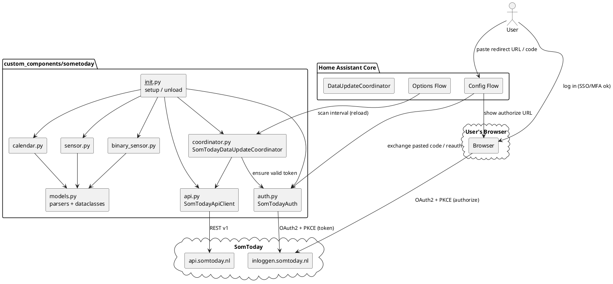
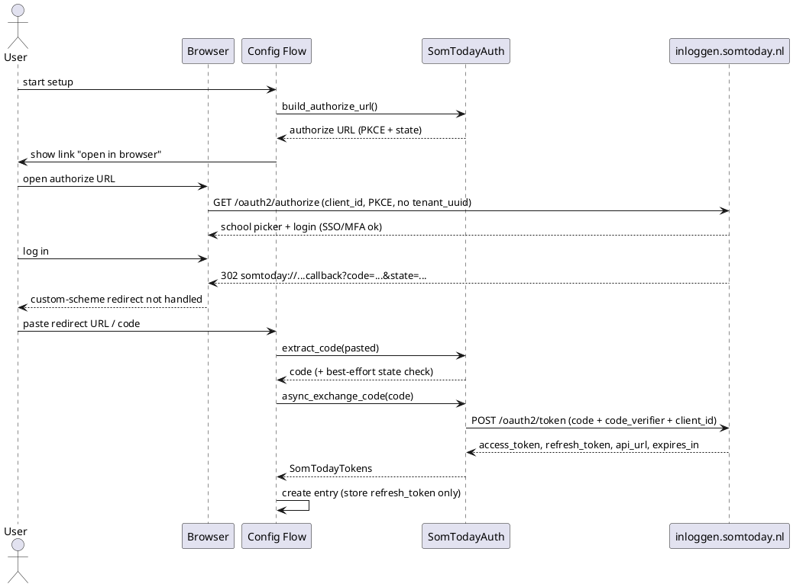
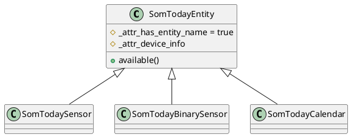

# Architecture: SomToday Home Assistant Integration

> Technical design for the SomToday custom component.
> Author: architect-agent (per `AGENTS.md`). Status: **Proposed v3 — multi-student identity revision**.
> Source of truth for the API: <https://github.com/elisaado/somtoday-api-docs>.
> The browser authorization-code + PKCE flow follows the MIT-licensed
> `jonisnet/ha-somtoday` integration.

## 0. Scope

This document describes the integration structure, the SomToday API endpoints,
the OAuth2 login flow, the entity model and the error handling.

**This revision implements the authentication layer only.** The
`DataUpdateCoordinator` and the entity platforms (`sensor`, `binary_sensor`,
`calendar`) are deferred to a later revision; their design is retained in §5–§8
as forward reference but is out of scope for the current code change.

Three verified facts (2026-09-11) invalidate the previous draft:

1. `GET https://servers.somtoday.nl/organisaties.json` no longer exists — it
   returns `301` to `https://inloggen.somtoday.nl`, which redirects into the
   login HTML. SomToday removed the school-list endpoint in February 2025
   (elisaado/somtoday-api-docs issue #42). There is therefore **no school-list
   / tenant-discovery step** and **no `tenant_uuid`** in the authorize request.
2. The OAuth2 **password grant is disabled**
   ("Password grant is disabled for insecure clients").
3. Server-side login-form scraping (POSTing to `0-1.-panel-signInForm` / the
   password form) is fragile and fails at SSO/MFA schools.

The chosen replacement is a **browser-based authorization-code + PKCE** flow
matching the MIT-licensed `jonisnet/ha-somtoday` integration (see
[§3](#3-authentication--oauth2-flow)). See
[§14](#14-corrections-to-the-previous-draft) for the corrections.

## 1. Focus finding: public OAuth2 client, no secret, no school list

**The client ID is a mandatory public constant. There is no client secret and
no school-list endpoint.**

Evidence:

1. **Documentation** (`Authentication.md`) lists `client_id` as a required
   parameter in the authorization-code and refresh flows:

   | Request | `client_id` |
   |---------|-------------|
   | `GET https://inloggen.somtoday.nl/oauth2/authorize` (app/webapp, PKCE) | `somtoday-leerling-native` |
   | `POST https://inloggen.somtoday.nl/oauth2/token` (code exchange, PKCE) | `somtoday-leerling-native` |
   | `POST https://inloggen.somtoday.nl/oauth2/token` (refresh, PKCE) | `somtoday-leerling-native` |
   | `POST https://somtoday.nl/oauth2/token` (legacy password / SSO) | `D50E0C06-32D1-4B41-A137-A9A850C892C2` |

2. **Live check** (2026-09-11): the authorize endpoint returns **HTTP 400**
   without `client_id`, and proceeds to the identity-provider login when
   `client_id=somtoday-leerling-native` is supplied.

Consequences for the design:

- **No client secret.** SomToday has used *public* OAuth2 clients since April
  2021; PKCE (`code_challenge_method=S256`) replaces the secret.
- **The client ID is a public constant, not user input.** It ships as a
  `const.py` constant; the config flow never asks for it. v1 uses
  `somtoday-leerling-native`.
- **No school-list endpoint.** `organisaties.json` was removed (Feb 2025). The
  authorize URL therefore **omits `tenant_uuid`**, and SomToday presents its
  own school picker in the browser. School/tenant selection happens on
  SomToday's side, not in our config flow.
- **No password grant, no server-side form scraping.** The password grant is
  disabled and form scraping breaks at SSO/MFA schools. Authentication is
  browser-based (see [§3](#3-authentication--oauth2-flow)).

### 1.1 Identity model — multiple students, schools and instances (v3)

The integration supports **multiple configured instances in Home Assistant**.
Two situations must work:

| # | Situation | How it is handled |
|---|-----------|-------------------|
| A | Each student has **their own SomToday account** (accounts may be at *different schools*) | Add the integration **once per account**: `integration_type: "hub"` + `config_flow: true` let the flow run repeatedly, producing one config entry per account. |
| B | One **parent/guardian account** can see **several students** (possibly at different schools) | Run the flow **once per student**. Requires a student-selection step and a composite unique id (this revision). |

**Model A (chosen): one config entry = one student = one device.** Identity is
the composite `(account_id, student_id)`:

```text
unique_id = f"{account_id}:{student_id}"
```

- `account_id` = `links[0].id` from `GET /rest/v1/account/me`. This endpoint is
  **required**: if it fails the flow reports a retryable `cannot_connect` rather
  than falling back to a student id, because a student-based fallback would be
  unstable (duplicate entries for the same student, or a false `wrong_account`
  during reauth).
- `student_id` = `links[0].id` of the chosen student.

This makes two entries distinct iff they differ in account **or** student, so a
parent account can be added once per child while the *same* student still cannot
be added twice.

> A single SomToday account can thus legitimately back several entries. Because
> SomToday rotates refresh tokens, each entry performs its own browser login and
> keeps its own (independently rotated) refresh token. The simpler alternative —
> one entry per account with one device per student — was considered and
> deferred (see [§12.6](#12-limitations--open-questions)).

## 2. Overview and design goals

The integration reads SomToday data (schedule, homework, grades, absence) and
exposes it as Home Assistant entities. It follows the standard HA integration
framework:

- `ConfigFlow` + `OptionsFlow` for configuration (`config_flow.py`).
- `DataUpdateCoordinator` polling every **15 minutes** by default
  (`coordinator.py`) — future work in this revision.
- An OO API client with an **injectable `aiohttp.ClientSession`** (`api.py`).
- Platforms: `sensor`, `binary_sensor`, `calendar` — future work.
- All parsing isolated in a typed model layer (`models.py`) so entities never
  touch raw JSON.

Design principles:

1. Standard HA patterns over custom plumbing (`entry.runtime_data`,
   `CoordinatorEntity`, `has_entity_name`, translation keys).
2. No third-party runtime dependency: use HA's shared `aiohttp` session. This
   keeps `manifest.json` `requirements` empty and simplifies testing.
3. Pure separation: **auth** (`SomTodayAuth`) / **transport**
   (`SomTodayApiClient`) / **parsing** (`models.py`) / **orchestration**
   (`coordinator.py`) / **presentation** (platforms).
4. Secrets are minimised: the authorization code and PKCE verifier are used
   once during the config flow and never stored; only the refresh token is
   persisted.

### Component diagram



### Class model

```text
SomTodayAuth
  - session: aiohttp.ClientSession
  - client_id: str = "somtoday-leerling-native"
  - tokens: SomTodayTokens | None
  - _code_verifier: str | None
  - _state: str | None
  + build_authorize_url() -> str
  + extract_code(pasted: str) -> str
  + async_exchange_code(code: str) -> SomTodayTokens
  + async_refresh_tokens() -> SomTodayTokens
  + async_ensure_valid() -> None
  - _generate_pkce_pair() -> tuple[str, str]
  - _generate_state() -> str

SomTodayApiClient
  - session: aiohttp.ClientSession
  - auth: SomTodayAuth
  - base_url: str
  + async_get_account() -> Account
  + async_get_students() -> list[Student]           # future work
  + async_get_schedule(start, end) -> list[Lesson]  # future work
  + async_get_grades(student_id) -> list[Grade]     # future work
  + async_get_homework(since) -> list[HomeworkItem] # future work
  + async_get_absence(start, end) -> list[Absence]  # future work
  + async_get_subjects() -> list[Subject]           # future work
  - _request(method, path, **kwargs) -> dict          # injects auth + Accept
  - _request_paginated(path, page_size=100) -> list   # Range: items=0-99

SomTodayDataUpdateCoordinator(DataUpdateCoordinator[SomTodayData])   # future work
  + _async_update_data() -> SomTodayData

SomTodayData (dataclass)                                            # future work
  + students: list[Student]
  + schedule: list[Lesson]
  + grades: list[Grade]
  + homework: list[HomeworkItem]
  + absence: list[Absence]
  + subjects: dict[str, Subject]
  + new_grades: list[Grade]
  + updated_at: datetime
```

## 3. Authentication / OAuth2 flow

### 3.1 Chosen strategy

**Browser-based authorization-code + PKCE.** The user logs in through SomToday's
own login page in *their* browser (which handles SSO and MFA correctly) and
pastes the resulting authorization code back into Home Assistant. HA then
exchanges the code server-side.

This mirrors the MIT-licensed `jonisnet/ha-somtoday` integration and avoids
every server-side approach SomToday has since disabled or broken (password
grant disabled; school-list endpoint removed; form scraping fragile). Because
the browser handles the identity provider, there is a single strategy for all
schools/accounts — no per-school `auth_method` is needed (unlike the previous
draft).

### 3.2 Authorization-code flow (browser + paste)

1. **Generate PKCE pair + state.**
   - `code_verifier`: 43–128 chars from the RFC 7636 unreserved set
     `[A-Za-z0-9\-._~]`.
   - `code_challenge` = base64url(SHA-256(verifier)) with padding stripped.
   - `state`: a fresh random token (≥ 128 bits) generated per flow and stored
     on the flow object.
2. **Build the authorize URL** (`SomTodayAuth.build_authorize_url()`) at
   `https://inloggen.somtoday.nl/oauth2/authorize` with:
   - `redirect_uri=somtoday://nl.topicus.somtoday.leerling/oauth/callback`
   - `client_id=somtoday-leerling-native`
   - `response_type=code`
   - `scope=openid`
   - `session=no_session`
   - `state=<generated>`
   - `code_challenge=<challenge>`
   - `code_challenge_method=S256`
   - **`tenant_uuid` is omitted** so SomToday shows its own school picker.
3. **User logs in** in their own browser (SSO/MFA work). On success the browser
   is redirected to the `somtoday://` custom scheme, which Home Assistant cannot
   receive. The user copies the failed redirect URL from the address bar (or
   the `Location:` header from DevTools, or a bare `code`) and pastes it into
   the config flow.
4. **Extract the code** (`SomTodayAuth.extract_code(pasted)`), forgivingly:
   - If the pasted string contains a `code` query parameter (e.g. the full
     `somtoday://…callback?code=…&state=…` URL), parse and return it.
   - Otherwise, treat the trimmed input as a bare code.
   - Best-effort `state` validation: if a `state` parameter is present it must
     match the generated state; a mismatch is a definitive rejection (the code
     must not be trusted). If no `state` is present (bare code / partial
     paste), skip the check and rely on the token exchange.
5. **Exchange the code** (`SomTodayAuth.async_exchange_code(code)`) at
   `POST https://inloggen.somtoday.nl/oauth2/token` with
   `Content-Type: application/x-www-form-urlencoded`,
   `Accept: application/json`, and body:
   - `grant_type=authorization_code`
   - `code`
   - `code_verifier`
   - `client_id=somtoday-leerling-native`
   - `scope=openid`
   - `session=no_session` (mirrors the authorize request)
6. **Store the response**: `access_token`, `refresh_token`,
   `somtoday_api_url`, `somtoday_tenant`, `expires_in` (typically 3600 s). If
   the response omits `somtoday_api_url`, keep the previously known value. Only
   the refresh token, `api_url` and account metadata are persisted; the code
   and verifier are discarded.



### 3.3 Exchange result handling

The token-exchange HTTP result maps to one of three outcomes:

| Outcome | Condition | Reaction |
|---------|-----------|----------|
| Success | HTTP 200 + JSON tokens | proceed to account discovery (§4) |
| Definitive rejection | HTTP 400 with `error=invalid_grant` | raise `SomtodayInvalidAuth` → `invalid_auth` / reauth |
| Retryable | any other non-200, network error, malformed body | `SomTodayConnectionError`/`SomTodayApiError` → retry / not ready |

Only `invalid_grant` is treated as a definitive rejection: it means the code
was already used, expired, or is otherwise invalid, so re-pasting the same code
can never succeed and the flow must escalate. Every other failure (transient
network, 5xx, malformed JSON) stays retryable so the user can retry without
restarting the flow.

### 3.4 Token refresh

- `SomTodayTokens.expires_at = utcnow() + expires_in`.
- `async_ensure_valid()` refreshes proactively when
  `expires_at - now < 120 s`; `SomTodayApiClient` refreshes reactively once on
  a `401`.
- `SomTodayAuth.async_refresh_tokens()`: `POST
  https://inloggen.somtoday.nl/oauth2/token` with `grant_type=refresh_token`,
  `refresh_token`, `client_id=somtoday-leerling-native`, `scope=openid`.
- **Rotating refresh tokens:** the response *may* contain a new
  `refresh_token`. If it does, persist it (via
  `hass.config_entries.async_update_entry`); if it does **not**, keep the old
  refresh token. Refresh is serialised with an `asyncio.Lock` to avoid
  concurrent rotations.

### 3.5 Config entry data / options

**`entry.data`** (secrets minimised):

```json
{
  "refresh_token": "<secret>",
  "api_url": "https://api.somtoday.nl",
  "account_id": "<id from /rest/v1/account/me>",
  "student_id": 1234,
  "student_name": "Eli Saado"
}
```

**`entry.options`:**

```json
{
  "scan_interval": 15,
  "schedule_days_ahead": 14,
  "homework_days_ahead": 7,
  "enable_grades": true,
  "enable_homework": true,
  "enable_absence": true
}
```

> **Security note.** HA stores config entries in `.storage/core.config_entries`
> as plaintext JSON; the refresh token is therefore not encrypted. This is the
> standard HA limitation. No password is stored. Document this to the user and
> recommend restricting `.storage/` permissions.

## 4. Config flow

`config_flow.py` implements `ConfigFlow, OptionsFlow`.

### 4.1 Steps

| Step | Purpose | Input | Errors / aborts |
|------|---------|-------|-----------------|
| `async_step_user` | Show authorize URL; collect pasted redirect/code; exchange + identify | multi-line `TextSelector` for the pasted URL/code | `invalid_auth`, `cannot_connect`, `no_students` |
| `async_step_student` | Choose a student when the account exposes >1 unconfigured student | `SelectSelector` over unconfigured students | — (auto-select when ≤1) |
| `async_step_reauth` → `async_step_reauth_confirm` | Re-auth after `ConfigEntryAuthFailed` | pasted redirect/code | `invalid_auth`, `cannot_connect`, `wrong_account`, `student_removed` |
| `async_step_init` (options) | Change poll interval / feature toggles | number + booleans | — |

Details:

- **Login step + student step.** There is no school selection and no credential
  form. The flow builds the authorize URL (with a fresh PKCE pair + `state`), the
  user logs in in their browser and pastes back the redirect/code. After a
  successful exchange the flow fetches `/rest/v1/account/me` and
  `/rest/v1/leerlingen`, computes the **unconfigured** students (composite unique
  id not already in `self._async_current_ids()`), and decides:

  | all students | unconfigured | Action |
  |--------------|--------------|--------|
  | 0 | — | error `no_students` (mint a fresh PKCE pair, stay in `user`) |
  | ≥1 | 0 | abort `already_configured` |
  | ≥1 | 1 | auto-select and create the entry (no extra step) |
  | ≥1 | >1 | show `async_step_student` |

- **Composite unique id.** Before the abort/create, call
  `async_set_unique_id(f"{account_id}:{student_id}", raise_on_progress=False)`
  and `_abort_if_unique_id_configured()`. See
  [§1.1](#11-identity-model--multiple-students-schools-and-instances-v3).
- **Chrome / custom-scheme guidance.** Chrome discards custom-scheme redirects,
  so after a successful login the address bar may be empty or show an error.
  The UI instructs the user to either copy the address bar *before* Chrome
  discards the `somtoday://` URL, or open **DevTools → Network**, find the
  request to the callback, and copy the `Location:` header value
  (`somtoday://nl.topicus.somtoday.leerling/oauth/callback?code=…`). A bare
  `code` is also accepted.
- **Reauth:** `entry.data` holds the refresh token plus account metadata.
  Re-running the browser-paste flow verifies the **account** identity: a
  different `account_id` aborts `wrong_account`; if the stored `student_id` is
  no longer in `/rest/v1/leerlingen`, abort `student_removed` (never silently
  re-point the student binding). Otherwise update tokens in place with
  `async_update_reload_and_abort`.
- **Migration (`VERSION = 2`).** v1 used `account_id` as the unique id; v2 uses
  the composite. `async_migrate_entry` recomputes
  `f"{account_id}:{student_id}"` for `version == 1` entries and applies it with
  `async_update_entry(entry, unique_id=…)`. No data keys change.
- **Options:** validated with
  `vol.All(vol.Coerce(int), vol.Range(min=MIN_SCAN_INTERVAL, max=MAX_SCAN_INTERVAL))`
  and applied by reloading the entry with
  `hass.config_entries.async_schedule_reload(entry.entry_id)` — no update
  listener.

### 4.2 UI strings

All labels/errors are translation keys in `strings.json` (English) and
`translations/nl.json` (Dutch). No hard-coded user-facing strings. The
authorize-URL step and the paste/DevTools instructions are localised here.

## 5. DataUpdateCoordinator

> **Future work.** Not implemented in this revision (authentication only).
> Retained as forward reference.

```text
SomTodayDataUpdateCoordinator(DataUpdateCoordinator[SomTodayData])
  update_interval = timedelta(minutes=scan_interval)   # default 15
  # self._student_id = entry.data[CONF_STUDENT_ID]  # fixed at setup, no students[0]
  _async_update_data():
      async with self._lock:
          await self._auth.async_ensure_valid()
          students = await self._api.async_get_students()
          data = SomTodayData(
              students = students,
              schedule = await self._api.async_get_schedule(today-1, today+N),  # filter per student
              grades   = await self._api.async_get_grades(self._student_id) if enabled,
              homework = await self._api.async_get_homework(today-1, self._student_id) if enabled,
              absence  = await self._api.async_get_absence(week_start, today) if enabled,
              subjects = await self._api.async_get_subjects(),
              updated_at = utcnow(),
          )
          return data
```

- **Student binding:** `self._student_id` is read from
  `entry.data[CONF_STUDENT_ID]` at construction. There is no `students[0]`
  fallback; the selected student is fixed at setup time.
- **Per-entry state:** one coordinator (and one `_last_grade_ids` set for
  `new_grade`) per config entry; entries never share coordinator state.

- **Default interval:** 15 minutes (`DEFAULT_SCAN_INTERVAL`), minimum 5, maximum
  1440, configurable via options.
- **First refresh:** `await coordinator.async_config_entry_first_refresh()` in
  `async_setup_entry`; failure aborts setup with the standard HA behaviour.
- **Serialisation:** a single `asyncio.Lock` prevents overlapping refresh + token
  rotation.
- **Cross-poll state:** `new_grade` (see [§8.2](#82-binary_sensor-platform))
  cannot be derived from a single response. The coordinator keeps
  `self._last_grade_ids: set` across polls and populates
  `SomTodayData.new_grades` with the grades whose IDs were not seen in the
  previous poll.

### 5.1 Error mapping

| Condition | Raised in client | Reaction |
|-----------|------------------|----------|
| HTTP 400 `error=invalid_grant` (token exchange) | `SomtodayInvalidAuth` | config flow shows `invalid_auth`; runtime → `ConfigEntryAuthFailed` (reauth) |
| `state` mismatch in pasted redirect | `ValueError("state_mismatch")` | config flow shows `state_mismatch` |
| `401` / `403` from data API | `SomTodayAuthError` | refresh once; still failing → `ConfigEntryAuthFailed` |
| Other token-exchange non-200 / malformed | `SomTodayConnectionError`/`SomTodayApiError` | retryable — flow shows `cannot_connect` and stays in step |
| Network error / timeout | `SomTodayConnectionError` | `UpdateFailed` → retry next cycle |
| `429 Too Many Requests` | `SomTodayRateLimitError` | `UpdateFailed`, honour `Retry-After` if present |
| `5xx` | `SomTodayApiError` | `UpdateFailed` → retry next cycle |
| Malformed JSON / unexpected schema | `SomTodayApiError` | `UpdateFailed` → retry next cycle |

HA's coordinator already applies exponential backoff after repeated
`UpdateFailed`s; no custom backoff is needed.

## 6. API client

`api.py` — `SomTodayApiClient`, constructed with an **injectable session** so
tests can mock it with `aioresponses`/`unittest.mock`:

```python
class SomTodayApiClient:
    def __init__(
        self,
        session: aiohttp.ClientSession,
        auth: SomTodayAuth,
        base_url: str,
    ) -> None: ...
```

- Every request sends `Authorization: Bearer <access_token>` and
  `Accept: application/json` (otherwise the API returns XML).
- `_request` maps HTTP status codes to the exception hierarchy in §5.1.
- `_request_paginated` walks `Range: items=<start>-<end>` in blocks of 100 until
  fewer than 100 records are returned (used by the grades endpoint).
- `async_get_account()` calls `GET /rest/v1/account/me` and is used by the
  config flow to derive the unique id (fall back to the student id from
  `/rest/v1/leerlingen`).
- Parsing lives in `models.py`; the client returns typed dataclasses
  (`Student`, `Lesson`, `Grade`, `HomeworkItem`, `Absence`, `Subject`, `Account`).

`auth.py` — `SomTodayAuth` owns `SomTodayTokens` and the browser PKCE strategy.
It depends only on an injectable `aiohttp.ClientSession`, so the OAuth2 flow is
unit-testable without network access. `exceptions.py` adds `SomtodayInvalidAuth`
(subclass of `SomTodayAuthError`) for the definitive `invalid_grant` / `state`
mismatch rejection.

## 7. SomToday API endpoints

Base URL for data requests = `somtoday_api_url` returned by the token endpoint
(usually `https://api.somtoday.nl`).

### 7.1 Authentication

| Method | URL | Purpose |
|--------|-----|---------|
| GET | `https://inloggen.somtoday.nl/oauth2/authorize` | Authorize (browser, PKCE, **no `tenant_uuid`**) |
| POST | `https://inloggen.somtoday.nl/oauth2/token` | Code exchange + refresh |

`https://servers.somtoday.nl/organisaties.json` is **gone** (301 → login HTML,
removed Feb 2025). The form-scraping POSTs (`0-1.-panel-signInForm`,
`…/login?2-1.-passwordForm`, `/?0-1.-panel-signInForm`) and the legacy
`somtoday.nl/oauth2/token` password/SSO endpoint are **not used**.

### 7.2 Data

| Method | Path (relative to `api_url`) | Purpose | Key parameters |
|--------|------------------------------|---------|----------------|
| GET | `/rest/v1/account/me` | Account info (unique id) | `additional=restricties` |
| GET | `/rest/v1/leerlingen` | Current student(s) | `additional=pasfoto` |
| GET | `/rest/v1/leerlingen/{id}` | Student detail | — |
| GET | `/rest/v1/afspraken` | Schedule | `sort=asc-id`, `additional=vak`, `additional=docentAfkortingen`, `additional=leerlingen`, `begindatum=YYYY-MM-DD`, `einddatum=YYYY-MM-DD` |
| GET | `/rest/v1/resultaten/huidigVoorLeerling/{id}` | Grades (paginated) | `Range: items=0-99` |
| GET | `/rest/v1/studiewijzeritemafspraaktoekenningen` | Homework linked to appointments | `begintNaOfOp=YYYY-MM-DD`, `geenDifferentiatieOfGedifferentieerdVoorLeerling`, `additional`, `jaarWeek` |
| GET | `/rest/v1/studiewijzeritemdagtoekenningen` | Homework per day | `begintNaOfOp`, `geenDifferentiatieOfGedifferentieerdVoorLeerling`, `additional` |
| GET | `/rest/v1/studiewijzeritemweektoekenningen` | Homework per week | `begintNaOfOp`, `geenDifferentiatieOfGedifferentieerdVoorLeerling`, `additional`, `weeknummer` |
| GET | `/rest/v1/absentiemeldingen` | Absence reports | `begindatumtijd`, `einddatumtijd` |
| GET | `/rest/v1/waarnemingen` | Attendance observations | `begintNaOfOp` / `beginDatumTijd` / `eindDatumTijd`, `isGeoorloofd` |
| GET | `/rest/v1/vakken` | Subjects | — |
| GET | `/rest/v1/icalendar` | iCal feed (alternative calendar source) | — |
| PUT | `/rest/v1/swigemaakt/{id}` | Mark homework done (v2, optional) | body `{leerling, gemaakt}` |
| PUT | `/rest/v1/swigemaakt/cou` | Mark homework done by `leerling` + `swiToekenningId` (v2, optional) | body `{leerling, swiToekenningId, gemaakt}` |

All three `studiewijzeritem*toekenningen` read endpoints accept the repeated
query parameter `additional` with values
`swigemaaktVinkjes`, `leerlingen`, `huiswerkgemaakt`,
`leerlingenMetInlevering`, `lesgroep`, `leerlingProjectgroep` and
`studiewijzerId`. v1 requests `additional=swigemaaktVinkjes` (to derive the done
state) and `additional=lesgroep` (to derive the subject). The appointment
endpoint takes `jaarWeek` where the week endpoint takes `weeknummer`.
The two `swigemaakt` write endpoints are alternatives: `/cou` works with only
the `swiToekenningId` when the `swigemaakt` row does not exist yet.

v1 fetches homework from **appointment + day + week** endpoints and merges them
(deduplicated by `links[0].id`) so no homework type is missed.

#### 7.2.1 Per-student scoping (multi-student accounts)

With one account that sees several students (Model A: separate entries, one per
student), each entry must read **only its own student's** data:

- **Schedule** (`/rest/v1/afspraken`): request
  `additional=leerlingen`; each appointment then carries the involved students
  in `additionalObjects.leerlingen.items`. Keep an appointment when it has no
  student list (the normal single-student shape) or when the entry's
  `student_id` is among them:
  `not lesson.student_ids or student_id in lesson.student_ids`.
- **Homework** (`studiewijzeritem*toekenningen`): pass the repeated query
  parameter **`geenDifferentiatieOfGedifferentieerdVoorLeerling=<student_id>`**
  so SomToday filters server-side (the reference integration does this).
- **Grades**: already per student via
  `/rest/v1/resultaten/huidigVoorLeerling/{student_id}`.
- **Absence** (`/absentiemeldingen`): not verified to be student-scoped; filter
  client-side on the `leerling` reference until confirmed (scheduled with the
  coordinator work).

### 7.3 JSON → dataclass field reference

This mapping is normative for the `models.py` parsers.

| Dataclass | Field | Source JSON |
|-----------|-------|-------------|
| `Account` | `id` | `links[0].id` |
| | `username` | `username` (if present) |
| `Student` | `id` | `links[0].id` |
| | `leerlingnummer` | `leerlingnummer` |
| | `roepnaam` | `roepnaam` |
| | `achternaam` | `achternaam` |
| | `email` | `email` |
| | `mobiel_nummer` | `mobielNummer` |
| | `geboortedatum` | `geboortedatum` |
| | `geslacht` | `geslacht` |
| | `pasfoto` | `additionalObjects.pasfoto.datauri` |
| `Lesson` | `id` | `id` |
| | `subject` | `vak.naam` |
| | `subject_abbr` | `vak.afkorting` |
| | `teacher` | `docentAfkortingen` |
| | `room` | `locatie` |
| | `start` | `beginDatumTijd` |
| | `end` | `eindDatumTijd` |
| | `title` | `titel` |
| | `type` | `afspraakType.naam` |
| `Grade` | `id` | `id` |
| | `result` | `resultaat` (float) |
| | `valid_result` | `geldendResultaat` |
| | `date` | `datumInvoer` |
| | `counts` | `not teltNietmee` |
| | `type` | `type` |
| | `subject` | `vak.naam` |
| `HomeworkItem` | `id` | `links[0].id` |
| | `topic` | `studiewijzerItem.onderwerp` |
| | `kind` | `studiewijzerItem.huiswerkType` |
| | `description` | `omschrijving` |
| | `subject` | `lesgroep.vak.*` |
| | `due` | `datumTijd` (day/appointment) or week range |
| | `done` | `additionalObjects.swigemaaktVinkjes.items[].gemaakt` |
| `Absence` | `id` | `id` |
| | `start` / `end` | `start` / `end` |
| | `reason` | `absentieReden.omschrijving` |
| | `allowed` | `absentieReden.geoorloofd` |
| | `handled` | `afgehandeld` |
| `Subject` | `id` | `id` |
| | `abbr` | `afkorting` |
| | `name` | `naam` |

`HomeworkItem.kind` takes the `studiewijzerItem.huiswerkType` values
`HUISWERK`, `TOETS` and `GROTE_TOETS`. It lets the homework-due sensors and the
calendar distinguish homework from tests (see [§8](#8-entity-model)).

## 8. Entity model

> **Future work.** Not implemented in this revision (authentication only).
> Retained as forward reference.

One **device per config entry** (per student). All entities set
`_attr_has_entity_name = True`, use translation keys, and share:

```python
DeviceInfo(
    identifiers={(DOMAIN, entry.entry_id)},
    name=f"SomToday {student_name}",
    manufacturer="SomToday",
    model="Student",
    entry_type=DeviceEntryType.SERVICE,
)
```

Unique IDs: `f"{entry.entry_id}_{key}"`. Availability follows
`CoordinatorEntity.available`; when the coordinator fails, entities become
`unavailable`.

### 8.1 `sensor` platform

| Key | Translation key | Device class | State class | State |
|-----|-----------------|--------------|-------------|-------|
| `next_lesson` | `next_lesson` | `TIMESTAMP` | — | Start of the next lesson |
| `next_lesson_name` | `next_lesson_name` | — | — | Subject of the next lesson |
| `next_lesson_room` | `next_lesson_room` | — | — | Room/location of the next lesson |
| `current_lesson` | `current_lesson` | — | — | Subject of the lesson in progress (`None` when free) |
| `lessons_today` | `lessons_today` | — | `MEASUREMENT` | Number of lessons today |
| `homework_open` | `homework_open` | — | `MEASUREMENT` | Open homework items |
| `homework_due_today` | `homework_due_today` | — | `MEASUREMENT` | Homework due today |
| `homework_next` | `homework_next` | `TIMESTAMP` | — | Due moment of the nearest open homework |
| `average_grade` | `average_grade` | — | `MEASUREMENT` | Mean of valid grades |
| `latest_grade` | `latest_grade` | — | `MEASUREMENT` | Most recently entered grade |
| `grades_count` | `grades_count` | — | `MEASUREMENT` | Number of grades in the period |
| `absence_recent` | `absence_recent` | — | `MEASUREMENT` | Unauthorised absence records this week |

Grade sensors expose per-subject grades as **attributes** (`grades: {subject:
grade}`) and the raw list as `grades_raw` (truncated), so users can build
templates without dozens of entities.

### 8.2 `binary_sensor` platform

| Key | Translation key | Device class | `on` when |
|-----|-----------------|--------------|-----------|
| `in_lesson` | `in_lesson` | `RUNNING` | Now is between a lesson's start and end |
| `has_lesson_today` | `has_lesson_today` | — | At least one lesson today |
| `homework_due_tomorrow` | `homework_due_tomorrow` | `PROBLEM` | Open homework due within 24 h |
| `new_grade` | `new_grade` | — | A grade was added since the previous poll |

`new_grade` renders `SomTodayData.new_grades`, which the coordinator computes
from the persisted `_last_grade_ids` set (see [§5](#5-dataupdatecoordinator));
it is `off` when that list is empty.

`homework_due_tomorrow` (and the calendar) must not conflate homework with
tests. `HomeworkItem.kind` distinguishes `HUISWERK` from `TOETS` /
`GROTE_TOETS`; v1 exposes both but tags the kind in the entity attributes so
users can filter. A `test_due_tomorrow` sensor is a future enhancement.

### 8.3 `calendar` platform

`SomTodayCalendar(CalendarEntity)`:

- `event` → current/next lesson (for the entity card).
- `async_get_events(hass, start_date, end_date)` → all lessons in the requested
  range, derived from the coordinator's `schedule` (the coordinator fetches a
  window of `today-1 … today+schedule_days_ahead`, default 14 days). If HA
  requests a range outside the cached window, the coordinator is refreshed or
  the API is queried for that range.
- Event fields: `summary` = `"{subject} ({room})"`, `start`/`end` from
  `beginDatumTijd`/`eindDatumTijd`, `location` = `locatie`,
  `description` = teacher abbreviations (`docentAfkortingen`).
- Read-only (no `CREATE_EVENT`).



## 9. `__init__.py` and runtime data

```text
async_setup_entry(hass, entry):
    auth = SomTodayAuth(session)
    auth.tokens = SomTodayTokens.from_entry(entry)
    api = SomTodayApiClient(session, auth, entry.data[CONF_API_URL])
    coordinator = SomTodayDataUpdateCoordinator(hass, entry, api, auth)   # future work
    await coordinator.async_config_entry_first_refresh()                  # future work
    entry.runtime_data = SomTodayRuntimeData(api=api, auth=auth, coordinator=coordinator)
    await hass.config_entries.async_forward_entry_setups(entry, PLATFORMS)

async_unload_entry(hass, entry):
    return await hass.config_entries.async_unload_platforms(entry, PLATFORMS)
```

When the rotating refresh token changes, persist `auth.as_entry_data()`
(refresh token + API URL + account metadata) rather than
`tokens.as_entry_data()` (see [§12](#12-limitations--open-questions)).

`entry.runtime_data` (modern HA pattern) is preferred over `hass.data[DOMAIN]`.
`async_migrate_entry` is provided for future schema changes.

## 10. Constants (`const.py`)

```python
DOMAIN = "sometoday"
PLATFORMS = [Platform.SENSOR, Platform.BINARY_SENSOR, Platform.CALENDAR]  # future work

CONF_REFRESH_TOKEN = "refresh_token"
CONF_API_URL = "api_url"
CONF_ACCOUNT_ID = "account_id"
CONF_STUDENT_ID = "student_id"
CONF_STUDENT_NAME = "student_name"
CONF_REDIRECT_URL = "redirect_url"        # transient flow field, never persisted
CONF_STUDENT_SELECT = "student_select"    # transient flow field, never persisted
CONF_SCAN_INTERVAL = "scan_interval"
CONF_SCHEDULE_DAYS_AHEAD = "schedule_days_ahead"
CONF_HOMEWORK_DAYS_AHEAD = "homework_days_ahead"
CONF_ENABLE_GRADES = "enable_grades"
CONF_ENABLE_HOMEWORK = "enable_homework"
CONF_ENABLE_ABSENCE = "enable_absence"

# One config entry per (account, student); shared by the flow and the migration.
def unique_id_for(account_id: str, student_id: int) -> str:
    return f"{account_id}:{student_id}"

DEFAULT_SCAN_INTERVAL = 15          # minutes
MIN_SCAN_INTERVAL = 5
MAX_SCAN_INTERVAL = 1440
DEFAULT_SCHEDULE_DAYS_AHEAD = 14
DEFAULT_HOMEWORK_DAYS_AHEAD = 7

# Public OAuth2 client (no secret; PKCE replaces it)
CLIENT_ID_APP = "somtoday-leerling-native"
AUTHORIZE_URL = "https://inloggen.somtoday.nl/oauth2/authorize"
TOKEN_URL = "https://inloggen.somtoday.nl/oauth2/token"
REDIRECT_URI = "somtoday://nl.topicus.somtoday.leerling/oauth/callback"
TOKEN_REFRESH_MARGIN = 120           # seconds
GRADES_PAGE_SIZE = 100
```

Removed from the previous draft: `CONF_TENANT_UUID`, `CONF_SCHOOL_NAME`,
`CONF_USERNAME`, `CONF_AUTH_METHOD`, `CLIENT_ID_SSO` and `SCHOOLS_URL` — there
is no school list, no stored username, no per-school auth method, and the
legacy SSO/password client is no longer used.

## 11. File structure

The `AGENTS.md` skeleton is extended with the auth client, model layer and the
two extra platforms required by §8. `AGENTS.md` should be updated accordingly.

```text
custom_components/sometoday/
├── __init__.py          # Setup, runtime_data, entry unload, migrations
├── manifest.json        # Metadata + version
├── config_flow.py       # Config + options + reauth flow
├── coordinator.py       # SomTodayDataUpdateCoordinator (future work)
├── api.py               # SomTodayApiClient (injectable session)
├── auth.py              # SomTodayAuth (browser authorization-code + PKCE)
├── exceptions.py        # Shared error hierarchy + SomtodayInvalidAuth (§5.1)
├── models.py            # Dataclasses + parsers
├── sensor.py            # Sensor entities (future work)
├── binary_sensor.py     # Binary sensor entities (future work)
├── calendar.py          # Calendar entity (future work)
├── entity.py            # Shared SomTodayEntity base (future work)
├── const.py             # Constants (CONF_*, DEFAULT_*, client ID)
├── strings.json         # Translations (source of truth, EN)
└── translations/
    ├── en.json          # English translations (loaded by HA)
    └── nl.json          # Dutch translations
```

Project root:

```text
README.md                # Install, configuration and troubleshooting guide
hacs.json                # HACS metadata for custom-repository installation
pytest.ini               # asyncio_mode = auto (needed by the HA test plugin)
requirements_test.txt    # Test dependencies (pytest, HA plugin, aioresponses)
```

`manifest.json`:

```json
{
  "domain": "sometoday",
  "name": "SomToday",
  "version": "0.4.0",
  "config_flow": true,
  "iot_class": "cloud_polling",
  "integration_type": "hub",
  "documentation": "https://github.com/<org>/<repo>",
  "issue_tracker": "https://github.com/<org>/<repo>/issues",
  "codeowners": ["@<owner>"],
  "requirements": [],
  "loggers": ["custom_components.sometoday"]
}
```

No `requirements` are needed: the integration uses HA's shared `aiohttp`
session. `version` is mandatory for custom components.

## 12. Limitations / open questions

1. **Refresh-token endpoint host.** The current flow uses
   `inloggen.somtoday.nl/oauth2/token` for both code exchange and refresh.
   Older documentation referenced `somtoday.nl/oauth2/token`, which is tied to
   the legacy SSO/password client and is not used in this revision. This needs
   validation against a real account during implementation.
2. **Rotating refresh tokens** must be persisted when the response rotates
   them; when it does not, the existing token is preserved (no-op write-back).
3. **Rate limits** are undocumented; the 5-minute minimum is a conservative
   guess.
4. **Multiple students** per account are supported (Model A): one entry per
   `(account, student)` with a composite unique id ([§1.1](#11-identity-model--multiple-students-schools-and-instances-v3)).
   **Open:** confirm the per-student scoping of `/absentiemeldingen` (and of the
   schedule when `additional=leerlingen` is unavailable); filter client-side
   until verified ([§7.2.1](#721-per-student-scoping-multi-student-accounts)).
5. **Write support** (`PUT /rest/v1/swigemaakt/{id}`) is out of scope for v1.
6. **One entry per account (device per student) alternative.** Considered and
   deferred: it avoids repeated browser logins for a parent account and fetches
   the schedule once, but requires a coordinator whose data is a per-student
   mapping and one device per student. Not needed while accounts are separate.

## 13. Testing hooks (for the tester-agent)

- `SomTodayApiClient` and `SomTodayAuth` accept an injected
  `aiohttp.ClientSession`, so HTTP is mocked with `aioresponses` and no real API
  call is ever made.
- `build_authorize_url()` is deterministic if PKCE/`state` generation is
  injectable; tests assert the exact authorize query (`client_id`, `scope`,
  `code_challenge_method=S256`, `session=no_session`, and the **absence** of
  `tenant_uuid`).
- `extract_code()` is pure and tested against full redirect URLs, DevTools
  `Location:` header values and bare codes, including the `state`-mismatch
  rejection.
- `async_exchange_code()` tests assert the token-exchange body
  (`grant_type=authorization_code`, `code_verifier`, `client_id`) and the
  `invalid_grant` vs retryable distinction; `async_refresh_tokens()` tests
  assert rotation preservation when the response omits the refresh token.
- Coordinator tests (future work) cover: successful update, `401` → refresh,
  refresh failure → `ConfigEntryAuthFailed`, timeout/5xx → `UpdateFailed`, and
  rotating-token persistence.
- Entity tests (future work) cover state, attributes, device classes, unique
  IDs and `unavailable` on `UpdateFailed`.

## 14. Corrections to the previous draft

The previous draft's `organisaties.json` + password/form-login design was
invalidated by SomToday's February 2025 changes (school list removed, password
grant disabled). This revision replaces it with the browser authorization-code
+ PKCE flow.

| Previous draft | Corrected design |
|----------------|------------------|
| School discovery via `organisaties.json` + `tenant_uuid` | No school list; authorize **omits `tenant_uuid`**, SomToday shows its own picker |
| Server-side PKCE form scraping + password-grant fallback | Browser authorization-code + PKCE, paste the code |
| SSO-only schools out of scope (`sso_not_supported`) | Browser flow handles SSO/MFA |
| `SomTodayAuthClient.async_login(...)`, `_async_pkce_login`, `_async_password_grant`, `_extract_code(location)` | `SomTodayAuth.build_authorize_url()`, `extract_code(pasted)`, `async_exchange_code(code)`, `async_refresh_tokens()` |
| Per-school `auth_method` stored in entry | Single browser flow; no `auth_method` |
| `invalid_grant` treated as a generic auth error | `SomtodayInvalidAuth` → definitive rejection → reauth |
| No `client_id` / implied `client_secret` | Public `client_id` constant (`somtoday-leerling-native`) + PKCE `S256`, no secret |
| Password stored in entry | Password never used; only rotating refresh token persisted |
| Endpoints `/leerlingen/{id}/rooster`, `/huiswerk`, `/cijfers` | `/rest/v1/afspraken`, `/rest/v1/studiewijzeritem*toekenningen`, `/rest/v1/resultaten/huidigVoorLeerling/{id}` |
| `sensor.py` only | `sensor` + `binary_sensor` + `calendar` (future work) |
| `hass.data[DOMAIN]` implied | `entry.runtime_data` |
| No pagination | `Range: items=0-99` for grades |

### v2 → v3 (identity model)

| v2 | v3 |
|----|----|
| `unique_id = account_id` (one entry per account) | `unique_id = f"{account_id}:{student_id}"` (one entry per student) |
| `student = students[0]` | `async_step_student` (`SelectSelector`) when >1 unconfigured; auto-select for 1 |
| No student step | `async_step_student` + `CONF_STUDENT_SELECT` |
| Reauth compared `account_id` to the unique id | reauth compares `account_id` to `entry.data[account_id]`, plus `student_removed` |
| `VERSION = 1` | `VERSION = 2` + `async_migrate_entry` unique-id recompute |
| Coordinator resolved `students[0]` at runtime | coordinator reads `entry.data[CONF_STUDENT_ID]` |
| Multi-student "future enhancement" | multi-student is the design focus; endpoint scoping is the open item |
